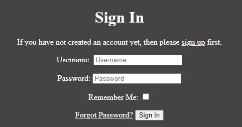
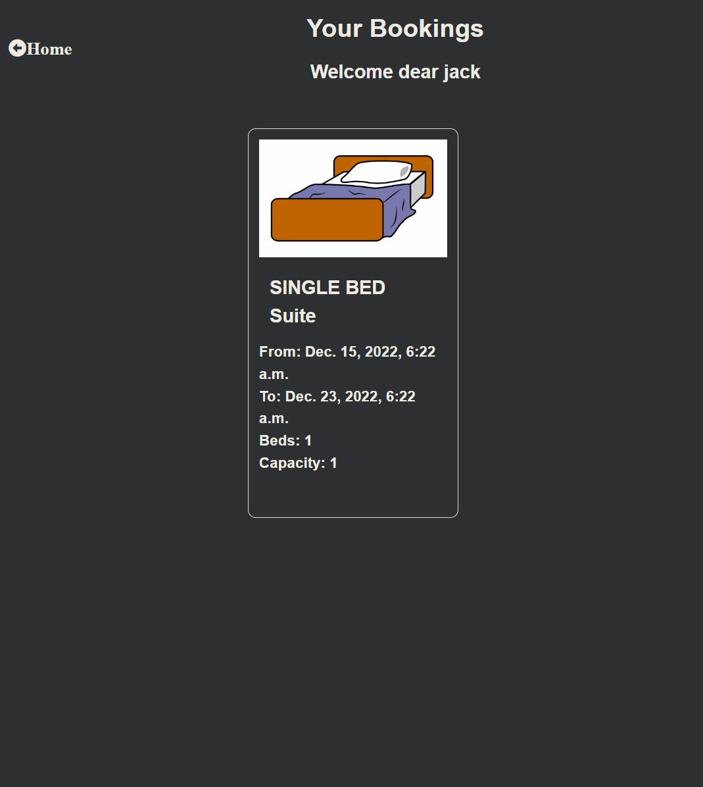

# **Ibrahims Hotel** 

I built this website for thosewho would like to book a hotel room at Hotel Ibrahim. The website has a booking system where users can register and book a certain room they would like and enter the start date to end date. The booking can be cancelled by the user or the admin. This website is mainly logic based and doesnt have much information as the information that would have been displayed if filled with lorum ipsem placement text.

[You can try it here on the live website!](https://project-4-ci.herokuapp.com/)

## _**User Stories**_

 ### _**Completed User Stories:**_
    
    * As a User I would like to have a clean layout what is easy to see through

    * As a User I want to able to register to the website to book a room

    * As a User I would like to have an easy navigation between the pages

    * As a User I would like to be able to book a room

    * As a User I would like to see my booking information and confirmation in a separate field

    * As an Staff member I would like to be able to delete bookings

    * As a User/Staff member I would like to edit or delete the reviews

 ### _**Not completed User Stories:**_
    * As a User I would like to see what day or time slots are available

    * As a User I would like to ask my own questions on the site

    * As a User I would like to write review about the company

    * As a User/Staff member I would like to be able to create bookings for someone

## _**Features**_

Users are able to log in

 Users are able to check bookings and admins are able to check all bookings

 ### _Future ideas:_
  * I would like to send e-mails when the user registered/booked a room
  * I would like to send an e-mail to confirm the booking.
  * Add a review section
  * The user can see which days and time slots are available to book.

  ## _**Design**_

  * ### _Colors:_
    * I kept a general Theme of grey and white throughout the website to keep it clean and consistent, I wanted this website to be more logic based

## _**Testing**_

* ### _W3C Validator:_
    * The following response was given to me: Document checking finished. No warnings or errors are displayed. the official [W3C Website](https://validator.w3.org/nu/?doc=https%3A%2F%2Fthe-deepest-cleaning-vm.herokuapp.com%2F)

* ### _CSS Validator:_
    * I got back the following message: Sorry! We found the following errors (16)
    URI : https://cdn.jsdelivr.net/npm/bootstrap@5.2.2/dist/css/bootstrap.min.css from the [Jigsaw Validator](https://jigsaw.w3.org/css-validator/validator?uri=https%3A%2F%2Fthe-deepest-cleaning-vm.herokuapp.com%2F&profile=css3svg&usermedium=all&warning=1&vextwarning=&lang=en) which is bootstrap fault my own CSS has no Error!

* ### _Lighthouse:_
    * I done the lighthouse check, results are following:

    

    The performance keep jumping up and down but always still in the green area the best practices is a bit lower because I used jQuery and the Google Maps API.

* ### _Manual testing:_

    #### **Register New Account**

    * Desired: I want to be able to register on the website in order to reserve a room.
    * Test: Create a new account with a username, a username that already exists, and both an email address and no email address.
    * Result: Whether or not an email address is entered, the new account is created if it has a username. The user is advised to pick a different username because the one they are trying to use already exists when creating a new account. The user logs in and receives an alert as soon as the account is registered.

    #### Login

    * Expected: As a registered site user you should be able to log in to your accout to be able to interact with the site.
    * Test: Check Login functionality as registered user. 
    * Outcome: When entering valid login details the user is logged in and redirected to the home page and an alert notifies the user that they are logged in. 

    #### Logout

    * Expected: As a registered and logged in user you should be able to log out of the site. 
    * Test: Check Logout functionality as logged in user. 
    * Result: When clicking Logout the user is redirected to Logout page and asked to confirm that they are want to log out. When Log Out button is clicked the user is logged out and redirected to home page and an alert notifies the user that they are logged out.  

    #### **Testing as a User**

    #### Make a Booking

    * Expected : The user can book an room and can view it in the booking view section until is not been approved and get a notification when the booking was done.
    * Test: Made the booking as a user.
    * Outcome: the booking is sucessfully made if it does not overlap with another date

    #### Delete a Booking
    
    * Expected : The user can delete a booking if they change thier mind i
    * Test: Delete the booking as a user.
    * Outcome: The booking is succesfully removed

    #### **Testing as a SuperUser**

    #### Delete Booking

    * Expected: The superuser is able to delete any booking made by anyone if it is been or not been approved.
    * Test: Delete any bookings made by any user
    * Outcome: Sucessfully deleted booking in both frontend and backend
    
## _**Deployment**_

* Making the Heroku App
    - In Heroku, click "Create new app."
    - Pick a name for your application and a location.

* Link GitHub repository:
    - To connect with Heroku, type your GitHub repo name in the GitHub deployment method field on the deploy tab.
    - Press Connect

* To deploy, go to the deploy page on the Heroku website, look for Manual Deploy, and select the "main" branch. Then, click Deploy Branch.

* ## _**Credits**_
    - alot of help from stack overflow and my peers who helped me solve issues that came along the way